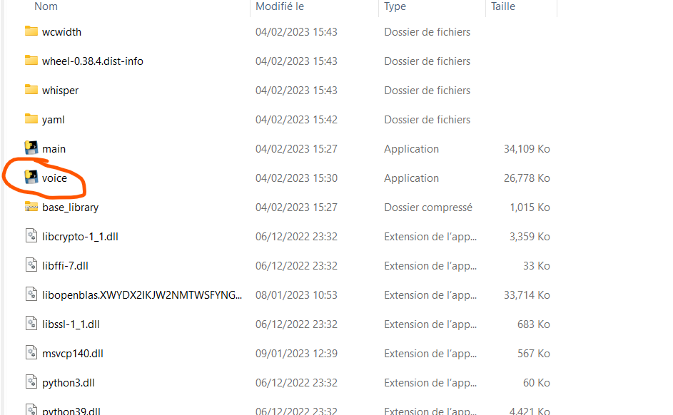

<h1 align="center"> :computer: MonikA.I. submod </h1>

  
   
  

This project aims to add new AI based features to [Monika After Story mod](https://github.com/Monika-After-Story/MonikaModDev) with the submod API.
It's using HuggingFace DialoGPT models, [TTS Coqui-AI](https://github.com/coqui-ai/TTS) for Text to Speech, [OpenAI Whisper](https://github.com/openai/whisper) with [microphone option](https://github.com/mallorbc/whisper_mic) for Speech to Text and [Character AI](https://character.ai/) for more realistic responses. An [emotion detection from text model](https://huggingface.co/michellejieli/emotion_text_classifier) is also used linked with the chatbot.
There is also emotion detection with the webcam with a model from [HSEmotion](https://github.com/HSE-asavchenko/face-emotion-recognition) (`facial_analysis.py`,`enet_b2_7.pt`,`mobilenet_7.h5`)

*Disclaimer: This project adds features (chatbots) that can be imprevisible and may not be in total accordance with the usual way Monika is supposed to speak. The goal is to have fun free interactions when running out of topics for example. There are also a lot of libraries and models involved so it can make the game slower when using them.*

Check the discord [server](https://discord.gg/2RsPuaDxEn) if you have some questions or if you want to be up to date with new fixes and releases !

# User friendly mode

## :boom: Installation (build for Windows OS only now)

- Go to the Github project: https://github.com/Rubiksman78/MonikA.I
- Go to Releases

- Download MonikA.I-version.zip and game.zip

- Unzip game.zip and put it in your DDLC folder, at the same level as the existing game (they have to merge together)

- Unzip MonikA.I-version.zip wherever you want
- Go to MonikA.I-version -> dist -> main -> main.exe and double click the executable

- One launched, enter your email (not username) and password from your character.ai account
- Write the path of your DDLC folder 
- Choose character (0 or 1 now) and other options
- Be sure to click every button with the option you want
- Submit and play ! 

For the full voicing mode:
- Do the same steps 
- Instead of launching `main.exe`, launch `voice.exe`

Your antivirus might block the execution of the file but it is a common issue with `pyinstaller` to convert python files to executables. All the code is available here for transparency.

## :fire: Features

- Allow Monika to finally see you through the webcam and react to your emotions (not supported on user version yet)
- Speak without scripted text with Monika using the latest chatbots from Character AI or HuggingFace DialoGPT
- Hear Monika speak with a Text to Speech module using extracts of voiced dialogues

## :alarm_clock: To develop (if you want to contribute)
- Improve dialogs to introduce the Submod the first time (telling what it does, how is it different from actual Monika)
- Add saving history of conversations to see again your best interactions
- Making it like a messaging app with questions/answers listed on a same window
- Define better facial expressions corresponding to predifined emotions (happiness,fear,surprise...)
- Convert more functionalities to executable files (TTS,Speech Recognition)
- Make the better TTS available only on MacOS/Linux for now usable also on other OS.
- Link this with Live2D for face movements with speech and emotions
- Face recognition for Monika only to recognize you
- Training new models for MEL Spectrogram Generation (Mixed TTS...) and Vocoders (UnivNet...)
- Speech to text to convert your own voice in text and directly speak with Monika :white_check_mark:
- Better face emotions detection :white_check_mark:
- Add possibility to see when microphone starts recording in the game for STT :white_check_mark:
- *Feel free to suggest improvements or new AI features you would like to see*

# Python version

## ❓Installation

- Clone the repository or download the latest release (`source code.zip`)
- Go to the project folder with your favorite IDE
- Be sure to have Python installed (3.8 or 3.9), TTS doesn't work with 3.10

To setup all the libraries:
- Just do `pip install -r requirements.txt` in a terminal opened within the project folder
- Don't forget to run also `python -m playwright install` to install the browsers.
(You can do `bash setup.sh` to do the `pip install` and the playwright install)
- If you have issues for installing TTS, someone made a video for that [here](https://www.youtube.com/watch?v=zRaDe08cUIk&t=743s).
- For troubleshooting and other issues, don't hesitate to submit an issue

## :heavy_plus_sign: Add to the game

The submod is in the folder `game`. To add it to your game, you have to add it in the root of your game folder (at the same location where there is already a `game` folder).

## :loudspeaker: Usage

Because of the high usage of Machine Learning algorithms, the inference can be quite long on CPU so it is advised to have a functional GPU for a better experience.
You would need also more RAM than usually, deactivate the TTS model, the emotion detection from text and/or emotion detection from face if it is taking too much ressources.

Launch the file `main.py` for the chatbot things and fill in the window the same as for the user version. Don't launch DDLC yourself, it will open automatically.
When the browser page launches, it can happen that you have to solve the captcha yourself, use debug mode if that happens.

For voicing of the game in real time, launch `voicing.py` and launch DDLC yourself when the message `Waiting for connection...` appears.

You can change the voice used by replacing the extract `talk_13.wav` in the `audio` folder by another audio extract. The longer the extract, the longer the TTS will take to generate the audio at each turn.

## :video_game: In Game

The features are available in a specific `AI` Talk menu in the game.

- Click on `Let's chat together` to use the Character AI Chatbot
- Click on `Look for me` to use the facial emotions detection in an interactive session
- Click on `Tell me about Pytorch` if you think it is superior to Tensorflow

## :cinema: Video Demonstration

https://user-images.githubusercontent.com/66365083/209359921-a4fdad5e-abbd-4550-a1fb-62d695e76c51.mp4

## :microphone: Better Voice (only on Linux,MacOS or WSL)

The voice used by Your TTS is obtained with zero-shot learning so it is not perfect and very closed to the original voice. To improve it, you can use the [FastPitch TTS from Nvidia NeMo](https://github.com/NVIDIA/NeMo).
The installation is quite painful, you can do the setup from this [notebook](https://github.com/NVIDIA/NeMo/blob/main/tutorials/tts/FastPitch_Finetuning.ipynb) and use the script `combined_server_for_the_bold.py` to launch the server with this TTS model. It will also take more RAM so be sure to have enough (at the very least 16GB).
You can try using the file `setup_new_tts.sh` to help you installing the requirements for this model.

Click [here](https://drive.google.com/drive/folders/1cgro9BbUJ53GFX1OizvNvmH0Cjnc7oqI?usp=sharing) to get the first part of the finetuned model (FastPitch model) and [here](https://drive.google.com/drive/folders/1NLNDTotB4Qyth_vLBmZMTLIg0dmIm6w0?usp=sharing) for the vocoder model (HifiGAN).

Little demonstration of this TTS model (pauses were cut for convenience):

https://user-images.githubusercontent.com/66365083/209716914-0ee87421-12df-4cc2-96da-9fd85f27214e.mp4

## :wrench: Troubleshooting

- "failed wheels for building TTS": check if you have python 3.8 or 3.9, and not 3.10 or higher
- "playwright command not found": run `python -m playwright install` instead
- "utf8 error": be sure to write the game path in the main script with "\\" and not "\" if you are on Windows
- "Monika says that there is a bug somewhere": that means the website couldn't be accessed, check if you've done the `playwright install` and check on your browser if the website isn't down. You can set `Use Debug Mode` to `Yes` to see the connection with the graphic interface.
