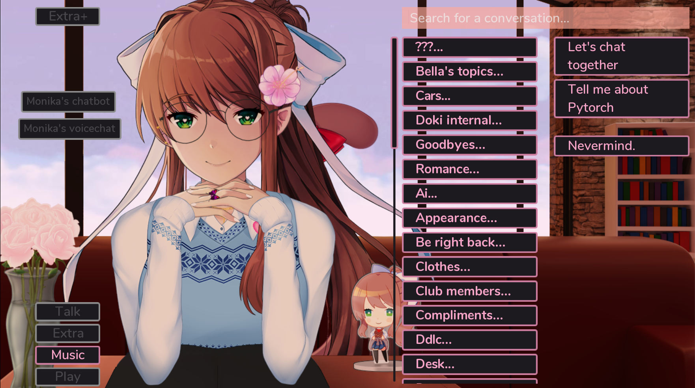
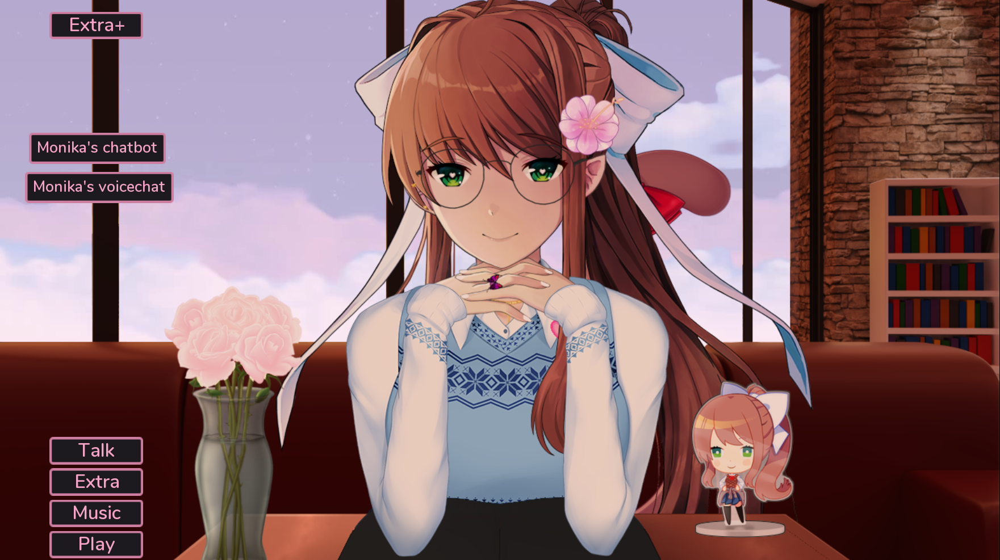

<h1 align="center"> :computer: MonikA.I. submod </h1>

<p align="center">
  <a href="https://github.com/Rubiksman78/MonikA.I./releases/latest">
    
  </a>
   <a href="https://github.com/Rubiksman78/MonikA.I./releases">
    
  </a>
  <a href="https://discord.gg/2RsPuaDxEn">
    
  </a>
</p>

This project aims to add new AI based features to [Monika After Story mod](https://github.com/Monika-After-Story/MonikaModDev) with the submod API.
It's using multiple AI models:
- [Pygmalion](https://huggingface.co/PygmalionAI) conversational AI based on GPT-J Finetuning
- [TTS Coqui-AI](https://github.com/coqui-ai/TTS) and [Tortoise-TTS](https://github.com/152334H/tortoise-tts-fast) for Text to Speech
- [OpenAI Whisper](https://github.com/openai/whisper) with [microphone option](https://github.com/mallorbc/whisper_mic) for Speech to Text
- [Character AI](https://character.ai/) if you don't have a GPU
- [Emotion detection from text model](https://huggingface.co/michellejieli/emotion_text_classifier) is also used linked with the chatbot
- Emotion detection with the webcam with a model from [HSEmotion](https://github.com/HSE-asavchenko/face-emotion-recognition) 
- NLI Classification with [deberta](https://huggingface.co/sileod/deberta-v3-base-tasksource-nli)

*Disclaimer: This project adds features (chatbots) that can be imprevisible and may not be in total accordance with the usual way Monika is supposed to speak. The goal is to have fun free interactions when running out of topics for example. There are also a lot of libraries and models involved so it can make the game slower when using them.*

Check the discord [server](https://discord.gg/2RsPuaDxEn) if you have some questions or if you want to be up to date with new fixes and releases !

# User friendly mode

## :boom: Installation 

(Build is for Windows OS only, see `Python version` section down here for other OS)

This version includes conversing with chatbots or full voicing of the game, the two modes might not be compatible so it is preferable to use them separetely.

To install the user version with executables, I've made a tutorial [HERE](../../wiki/Installation-tutorial-(after-1.6.1)) for versions equal or after 1.6.1 and [here](../../wiki/Installation-tutorial-(before-1.6.0)) for versions equal or before 1.6.0.

## :fire: Features

- Allow Monika to finally see you through the webcam and react to your emotions
- Speak without scripted text with Monika using the latest chatbots from Character AI or Pygmalion AI
- Hear Monika speak with a Text to Speech module using extracts of voiced dialogues
- Talk with your own voice with Monika thanks to Speech recognition
- Let Monika control actions in the game directly from your chat with her

## :star2: Pygmalion chatbots

Be sure to follow the instructions [here](../../wiki/Install-Pygmalion-locally) to use it.

## :microphone: Customize Monika's voice

For Your TTS model (worse but faster, ~5s per turn):
You can change the voice used by replacing the extract `talk_13.wav` in the `audio` folder by another audio extract. The longer the extract, the longer the TTS will take to generate the audio at each turn.

For Tortoise TTS model (better but slower, ~40s per turn): You can change the voice samples in `tortoise-tts-fast/tortoise/voices` folder. Create your own character by adding a folder with the name of your character and put the audio samples in it. The samples must be around 10 seconds long and at the number of 5 maximum. There are some default samples in `example_samples` made from this [post](https://www.reddit.com/r/MASFandom/comments/10sz2z3/giving_monika_a_voice_using_new_ai_technology_to/) thanks to [u/VBandit47](https://www.reddit.com/user/VBandit47/).

On CPU, it can take 10x more time to generate the voice (Tortoise TTS can have unexpected behaviour on CPU)

# How to contribute

If you want to contribute to the project, you can check out this [page](../../wiki/How-to-contribute).
It is not necessary to know how to code and you can add dialogs, expressions. Don't hesitate to propose new things if you have more experience !

# Demonstrations

## :video_game: In Game

The features are available in a specific `AI` Talk menu in the game.


- Click on `Let's chat together` to use the Character AI Chatbot
- Click on `Tell me about Pytorch` if you think it is superior to Tensorflow

There is also the possibility of using buttons on the main screen to directly chat. These can be disabled in the Settings Submods if you don't like them.


## :cinema: Video Demonstration

https://user-images.githubusercontent.com/66365083/209359921-a4fdad5e-abbd-4550-a1fb-62d695e76c51.mp4

# Python version (For Linux or MacOS users)

## ❓Installation

- Clone the repository or download the latest release (`source code.zip`)
- Go to the project folder with your favorite IDE
- Be sure to have Python installed (3.8 or 3.9), it is not tested and functional before 3.7 and after 3.10.

To setup all the libraries:
- Run these commands in a terminal opened within the project folder to install the packages (the 2nd one only if you want and can use GPU):
    ```
    pip install -r requirements.txt
    pip install simpleaudio
    pip install torch torchvision torchaudio --extra-index-url https://download.pytorch.org/whl/cu117
    python -m playwright install firefox
    ```
- If there was an error returned during the installation of the packages, delete the corresponding line in `requirements.txt` and dowload the package concerned manually
- To download TTS (first model with Coqui AI TTS), run these commands:
    ```
    git clone https://github.com/coqui-ai/TTS
    cd TTS
    pip install -e .
    cd ../
    ```
- To download TTS (new model with Tortoise-TTS), run these commands:
    ```
    git clone https://github.com/152334H/tortoise-tts-fast
    cd tortoise-tts-fast
    pip install -e .
    cd ../
    ```
- `simpleaudio` or other packages might need to install Visual Studio C++ Tools too (see tutorial [here](https://stackoverflow.com/questions/64261546/how-to-solve-error-microsoft-visual-c-14-0-or-greater-is-required-when-inst)), for `simpleaudio` follow [this](https://stackoverflow.com/questions/67312738/error-command-errored-out-with-exit-status-1-python-when-installing-simple)
- If you want to use Pygmalion models, follow these intructions:
  - To use `int8` i.e. models taking less GPU RAM with `bitsandbytes` (only compatible with recent GPUs):
     - Download these 2 dll files from [here](https://github.com/DeXtmL/bitsandbytes-win-prebuilt). Move those files in your python packages folder, on Windows it is something like `C:\Users\MyName\AppData\Local\Programs\Python\Python39\Lib\site-packages\bitsandbytes`
     - Edit `bitsandbytes\cuda_setup\main.py`: 
       - Change `ct.cdll.LoadLibrary(binary_path)` to `ct.cdll.LoadLibrary(str(binary_path))` two times in the file.
       - Replace the this line ```if not torch.cuda.is_available(): return 'libsbitsandbytes_cpu.so', None, None, None, None``` with ```if torch.cuda.is_available(): return 'libbitsandbytes_cuda116.dll', None, None, None, None```
   - Follow the instructions in the [wiki](https://github.com/Rubiksman78/MonikA.I/wiki/Install-Pygmalion-locally)
- For troubleshooting and other issues, don't hesitate to submit an issue

## :heavy_plus_sign: Add to the game

The submod is in the folder `game`. To add it to your game, you have to add it in the root of your game folder (at the same location where there is already a `game` folder).

## :loudspeaker: Usage

Because of the high usage of Machine Learning algorithms, the inference can be quite long on CPU so it is advised to have a functional GPU for a better experience.
You would need also more RAM than usually, deactivate the TTS model, the emotion detection from text and/or emotion detection from face if it is taking too much ressources.

Execute `python main.py` for the chatbot things and fill in the window the same as for the user version. Don't launch DDLC yourself, it will open automatically (unless you check the option `Launch yourself`).
When the browser page launches, it can happen that you have to solve the captcha yourself, use debug mode if that happens.

For voicing of the game in real time, run `python voicing.py` and launch DDLC yourself when the message `Waiting for connection...` appears.

## :wrench: Troubleshooting

- "failed wheels for building TTS": check if you have python 3.8 or 3.9, and not 3.10 or higher
- "playwright command not found": run `python -m playwright install` 
- "Monika says that there is a bug somewhere": that means the website couldn't be accessed, check if you've done the `playwright install` and check on your browser if the website isn't down. You can set `Use Debug Mode` to `Yes` to see the connection with the graphic interface.
